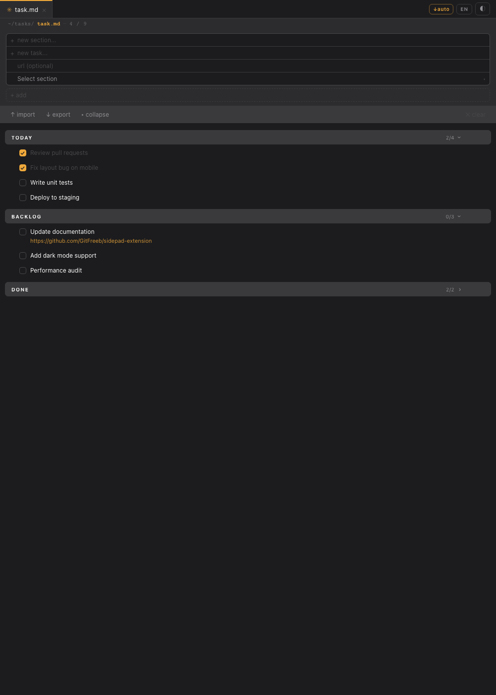
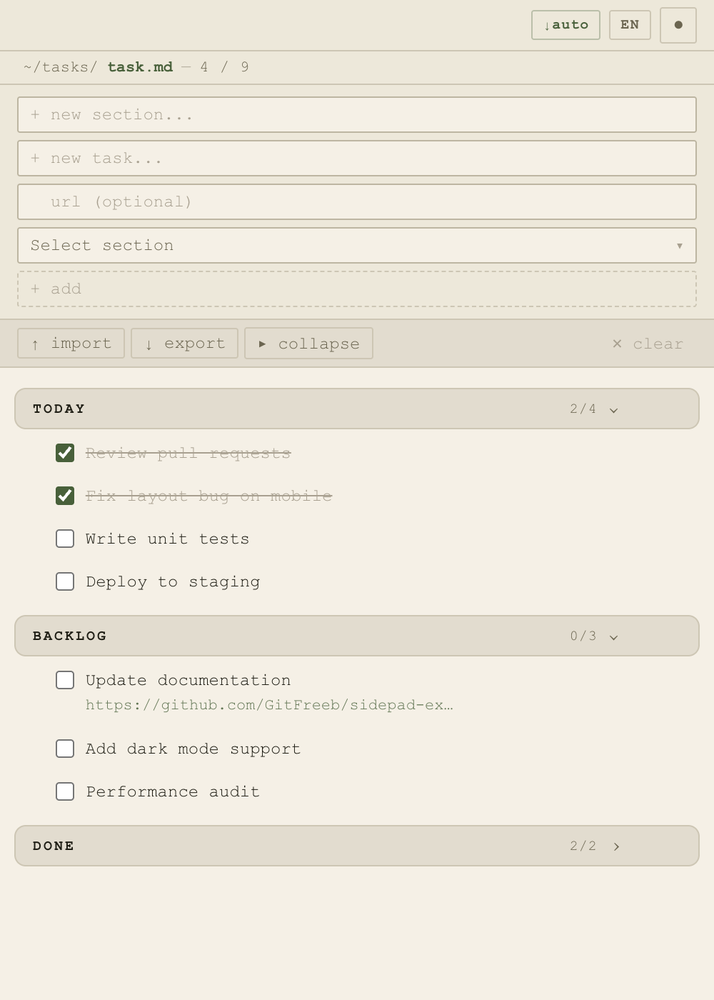

# Sidepad

English version | [Русская версия → README.ru.md](README.ru.md)

A Chrome side panel for managing task lists in Markdown format. Works as a native Side Panel — stays alongside the page without covering it.

 

---

## Table of Contents

- [What is it](#what-is-it)
- [Features](#features)
- [Installation](#installation)
- [Quick Start](#quick-start)
- [Interface](#interface)
- [Working with Tasks](#working-with-tasks)
- [Working with Sections](#working-with-sections)
- [Tabs](#tabs)
- [Import and Export](#import-and-export)
- [Drag and Drop](#drag-and-drop)
- [Keyboard Shortcuts](#keyboard-shortcuts)
- [Data Storage](#data-storage)
- [Technical Details](#technical-details)

---

## What is it

**Sidepad** is a Chrome extension that opens a side panel with a task list. The panel works alongside any browser tab without closing it. Tasks are stored locally in the browser and read/saved in Markdown (`.md`) format.

The extension requires no registration, sends no data over the network, has no dependencies, and requires no build step.

---

## Features

### Tasks
- Add tasks with text, URL link, and section assignment
- Mark tasks as done (checkbox)
- Edit task text by clicking
- Delete user-created tasks
- Copy task text to clipboard with one button
- Move a task to another section with the `→` button (appears on hover)
- Completed tasks automatically move to the end of their section

### Sections
- Group tasks into named sections
- Add new sections via a form
- Collapse/expand sections by clicking the header
- "▸ Collapse all / ▾ Expand" button to manage all sections at once
- Rename a section with the `✎` button (appears on hover over the header)
- Delete a section along with all its tasks
- Auto-collapse a section when all its tasks are completed
- Completed task counter in each section header

### Tabs
- Work with multiple lists simultaneously in separate tabs
- Each imported file opens in a separate tab
- Rename a tab by double-clicking its name
- Hidden-tab indicator (`+N`) when the tab bar overflows horizontally
- Closing a tab automatically saves the list to Downloads
- Closing the last tab resets the content to an empty default state

### Import and Export
- Load `.md` and `.txt` files via the system file dialog
- Save the current list to `.md` via a Save As dialog
- `↓auto` button to toggle auto-save to Downloads on/off
- Support for `[x]` and `[ ]` checkboxes in Markdown
- URLs in tasks are extracted and become clickable links

### Appearance
- Dark and light theme (toggle in the header)
- Language switch: Russian / English (toggle in the header)
- Drag & Drop for tasks and sections

---

## Installation

1. Download or clone the repository
2. Open in Chrome: `chrome://extensions`
3. Enable **Developer mode** (toggle in the top right corner)
4. Click **Load unpacked**
5. Select the `Sidepad/` folder
6. Click the extension icon in the Chrome toolbar — the side panel will open

> After changing extension files, click the reload button on the extension card in `chrome://extensions`, then close and reopen the side panel.

---

## Quick Start

The extension folder contains `example.md` — a ready-made list with tasks that demonstrates all Sidepad features: sections, links, drag & drop, import and export.

Two ways to load the example:

- **Button in the empty list:** on first launch, the empty `default.md` shows a **"Load example →"** button — click it and `example.md` opens immediately
- **Manually:** click **↑ import** and select `example.md` from the `Sidepad/` folder

After loading, `default.md` closes automatically.

---

## Interface

```
┌─────────────────────────────────┐
│ ✳ default.md  ×  ✳ work.md  ×  ↓auto RU ◐│  ← Tabs + action buttons
├─────────────────────────────────┤
│ ~/tasks/ default.md     —  3 / 10  │  ← Breadcrumb + done counter
├─────────────────────────────────┤
│ + new section...                │  ← New section field
│ + new task...                   │  ← New task field
│   url (optional)                │  ← URL field
│ [Select section ▾]  [+ add]     │  ← Dropdown + add button
├─────────────────────────────────┤
│ ↑ import  ↓ export  ▸ collapse  ✕ clear│  ← Toolbar
├─────────────────────────────────┤
│ ▸ Section 1             2/5   › │  ← Section header (collapsed)
│ ▾ Section 2             0/3   › │  ← Section header (expanded)
│   ⠿ ☐  Task with link   ⧉ → × │  ← Task (buttons appear on hover)
│         https://example.com     │
│   ⠿ ☑  Completed task    ⧉ ×  │  ← Completed task (with delete button)
└─────────────────────────────────┘
```

### Interface Elements

| Element | Description |
|---|---|
| `✳ name.md ×` | Tab. `×` — close with auto-save to Downloads |
| `RU` / `EN` | Language toggle button |
| `◐` / `●` | Dark/light theme toggle |
| `~/tasks/ name.md` | Breadcrumb — current tab name |
| `N / M` | Counter: done / total tasks |
| `↑ import` | Open a `.md` file in a new tab |
| `↓ export` | Save the current list to a file |
| `✕ clear` | Clear the list (auto-saves to Downloads) |
| `⠿` | Drag handle for a task |
| `⧉` | Copy task text to clipboard |
| `×` on a task | Delete the task |
| `×` on a section | Delete the section with all its tasks (appears on hover) |
| `✎` on a section | Rename the section (appears on hover) |
| `→` on a task | Move the task to another section (appears on hover) |
| `N/M` in section header | Done / total in this section |
| `↓auto` | Toggle auto-save to Downloads on/off |
| `▸ collapse` / `▾ expand` | Collapse or expand all sections at once |

---

## Working with Tasks

### Add a Task

1. Fill in the **"+ new task..."** field
2. Optionally specify a URL in the **"url (optional)"** field
3. Choose a section from the dropdown (default — "Extra tasks")
4. Press **"+ add"** or `Enter`

The new task is added to the beginning of the selected section.

### Mark as Done

Click the **checkbox** to the left of the task. A completed task moves to the end of its section and is visually marked. If all tasks in a section are done — the section auto-collapses.

Clicking again removes the checkmark.

### Edit a Task

Click on the **task text**. The text becomes an editable field. To save — press `Enter` or click outside. To cancel — press `Escape`.

### Delete a Task

Click the **`×`** button to the right of the task. The button is only available for manually added tasks.

### Copy Text

Click **`⧉`** — the task text is copied to the clipboard, and a "⧉ copied" notification briefly appears.

### Move to Another Section

Hover over a task — the **`→`** button appears on the right. Click it and select a section from the menu. The task moves to the beginning of the selected section.

### Open a Link

If a task has a URL, it is displayed below the text. Clicking the link opens it in a new browser tab.

---

## Working with Sections

### Add a Section

1. Fill in the **"+ new section..."** field
2. Press **"+ add"** or `Enter` while in the section field

The new section is added to the top of the list and becomes available in the dropdown when adding tasks.

> If both fields are filled (both section and task) — pressing "+ add" will add both.

### Collapse / Expand a Section

Click the **section header**. The `›` arrow indicates direction.

A section automatically collapses when all its tasks are marked as done.

The **"▸ collapse all"** button in the toolbar collapses all sections at once. Clicking it again — **"▾ expand"** — restores them.

### Rename a Section

Hover over the section header — a **`✎`** button appears on the right. Click it — the header becomes an editable field. To save — press `Enter` or click outside. To cancel — press `Escape`.

If the new name matches an existing section, tasks from both sections are merged.

### Delete a Section

Hover over the section header — a **`×`** button appears on the right. Click it. The section and all its tasks are deleted without confirmation.

---

## Tabs

Each imported file opens as a separate tab. Tabs allow working with multiple lists simultaneously.

### Switch Tabs

Click the desired tab in the top bar. Each tab's state is saved when switching.

### Close a Tab

Click **`×`** on a tab. The current list version is automatically saved to the Downloads folder as `name_YYYY-MM-DD_HH-MM.md`.

Closing the last tab does not clear the list — the content resets to the empty `default.md` state.

### Rename a Tab

Double-click the **tab name** to edit it inline. The `.md` extension is always appended automatically — you only edit the name part. Press `Enter` to confirm, `Escape` to cancel.

---

## Import and Export

### Import a File

Click **↑ import**. A system file dialog opens (`.md`, `.txt` formats). After selecting, the file is parsed and opens in a new tab.

The format is detected automatically:

**Markdown** (file contains `- ` or `* ` bullets):

```markdown
# List title

## Section name

- [ ] Uncompleted task
- [x] Completed task
- [ ] Task with link  https://example.com

## Another section

- [ ] Another task
```

- Lines `## Heading` become sections
- Lines `- [ ]`, `- [x]`, `* ` become tasks
- A URL in a task line automatically becomes a clickable link
- Lines starting with `#`, `|`, `` ` ``, `!` and lines longer than 120 characters are ignored

**Plain text** (no `- ` / `* ` bullets — numbered lists, plain text notes):

```
SECTION HEADING

1. First task
2. Second task

Another section:
* Third task
• Fourth task
```

- `ALL CAPS LINE` (≤ 60 chars) → section
- `Line ending with :` (≤ 60 chars) → section
- Heading underlined with `---` or `===` → section
- `1.` / `1)` numbered items → tasks
- `*` / `•` bullet items → tasks
- Any other plain line → task
- `[x]`, `✓`, `✔` marks a task as done

### Export to `.md` File

Click **↓ export**. A Save As dialog opens with the current filename. The exported file contains all sections and tasks with `[x]` / `[ ]` marks.

### Auto-save

Controlled by the **`↓auto`** button in the tab bar. Enabled by default. When turned off, the button dims and auto-save is disabled.

When auto-save is enabled, the file is saved:
- When closing a tab with `×`
- When pressing **✕ clear** (before deleting the content)

The `example` tab is never auto-saved. The `default` tab saves without a confirmation dialog.

The file is saved to Downloads as `name_YYYY-MM-DD_HH-MM.md`. If the filename already contains a timestamp, it is replaced rather than appended again.

---

## Drag and Drop

Drag & drop is supported for both tasks and sections.

### Drag Tasks

Grab a task by the **`⠿` handle** and drag:
- **Onto another task** — places it before or after it (depending on cursor position)
- **Onto a section header** — moves the task to that section (at the end)

> As an alternative to drag & drop, use the **`→`** button on hover — the task moves to the beginning of the selected section.

### Drag Sections

Grab a **section header** and drag it onto another header — the section with all its tasks moves before or after the target section.

---

## Keyboard Shortcuts

| Key | Context | Action |
|---|---|---|
| `Enter` | Task field | Add task |
| `Enter` | Section field | Add section |
| `Enter` | URL field | Add task |
| `Enter` | Edit task | Save changes |
| `Escape` | Edit task | Cancel changes |
| `Enter` | Rename section | Save new name |
| `Escape` | Rename section | Cancel rename |
| `Enter` | Rename tab | Save new name |
| `Escape` | Rename tab | Cancel rename |
| `↑` / `↓` | Section dropdown | Navigate sections |
| `Enter` / `Space` | Section dropdown | Select section |
| `Escape` / `Tab` | Section dropdown | Close dropdown |

---

## Data Storage

All data is stored in `chrome.storage.local` — locally in the browser, with no network transmission.

**Storage structure:**

```json
{
  "tabs": [
    {
      "id": "tab_1234567890",
      "title": "work",
      "tasks": [ ... ],
      "sections": ["Priority", "Backlog"]
    }
  ],
  "activeTabId": "tab_1234567890",
  "lightMode": false,
  "lang": "en",
  "autoSave": true
}
```

Data is saved on every change and restored on the next panel open. Legacy data format (before tabs were introduced) automatically migrates on first open.

---

## Technical Details

| Parameter | Value |
|---|---|
| Manifest version | V3 |
| Permissions | `storage`, `sidePanel` |
| Dependencies | none |
| Build | not required |
| Stack | Vanilla JS, HTML, CSS |
| Entry point | `popup.html` → `popup.js` |
| Service Worker | `background.js` |

**Extension folder structure:**

```
Sidepad/
├── manifest.json       — extension configuration
├── background.js       — service worker, opens panel on click
├── popup.html          — UI markup
├── popup.css           — styles
├── popup.js            — all logic
├── default.md          — empty default list
├── example.md          — usage example for new users
├── README.md           — documentation (Russian)
├── README.en.md        — documentation (English)
├── INFO.ru.txt         — plain text documentation (Russian)
├── INFO.en.txt         — plain text documentation (English)
└── icons/
    ├── icon16.png
    ├── icon32.png
    ├── icon48.png
    └── icon128.png
```

**Task ID convention:** built-in tasks have `id ≤ 10000`, user-created tasks have `id > 10000` (calculated as `Date.now() + 10001`). The delete button is only shown for tasks with `id > 10000`.
